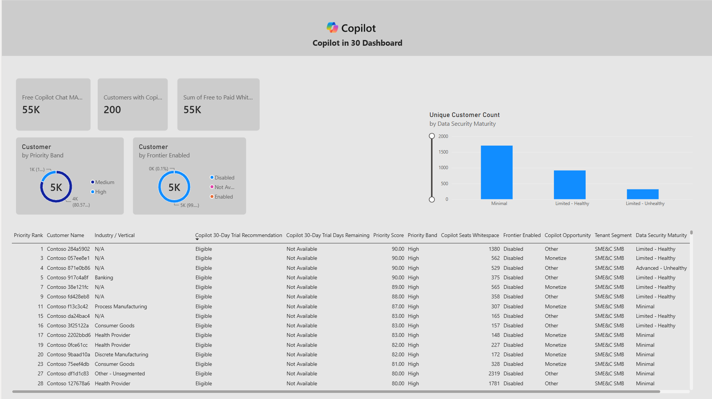
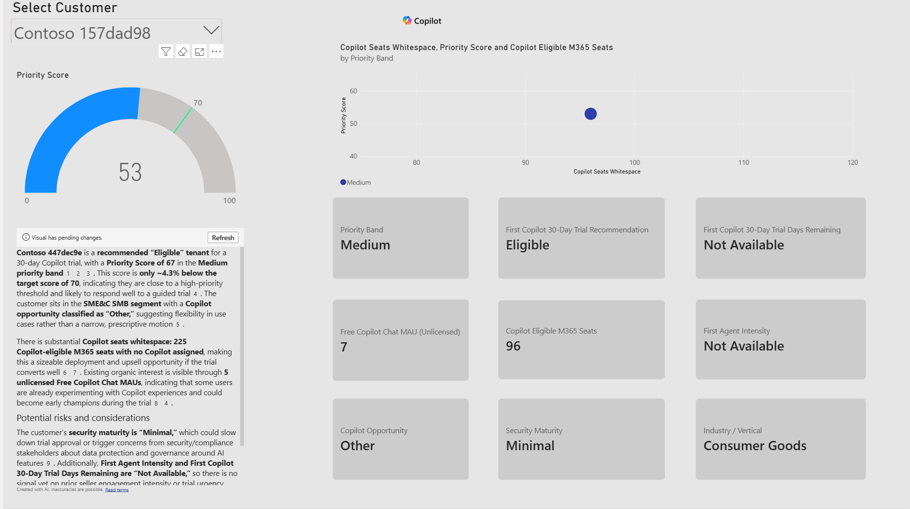

# Copilot for 30 Power BI Dashboard

Power BI dashboard for partners using ASPXI Copilot Opportunities data to identify, prioritise, and target customers for Copilot for 30 trial motions.

The report helps partners move from broad opportunity lists to a focused set of top prospects by combining Copilot eligibility, whitespace, free Copilot Chat usage, Frontier readiness, security maturity, and partner/customer routing signals.

## Dashboard preview

### Opportunity overview



### Customer view



## What this report is for

This dashboard is designed to help partners:

- Identify customers who are strong candidates for Copilot for 30 trials.
- Prioritise outreach using a simple customer-level priority score.
- Compare eligible seats, Copilot whitespace, free Copilot Chat usage, and paid adoption signals.
- Focus seller and partner follow-up on the customers most likely to benefit from a trial.
- Use ASPXI Copilot Opportunities data in a repeatable Power BI view.

## Data source

The dashboard is built around the Microsoft Partner Center / ASPXI Copilot Opportunities data export.

Reference: [Copilot Opportunities tab data dictionary](https://learn.microsoft.com/en-us/partner-center/insights/growth-opportunities-data/copilot#copilot-opportunities-tab-data-dictionary)

ASPXI uses Microsoft 365 product usage, free Copilot usage, whitespace, agent usage, licensing, propensity models, and partner association signals to provide account-level Copilot growth insights.

## Core dashboard logic

### Priority score

Priority Score ranks customers for Copilot Trial outreach on a 0 to 100 scale. It gives higher scores to customers with more eligible M365 seats, larger Copilot whitespace, stronger free-to-paid conversion potential, Grow or Monetize opportunity signals, and high agent intensity. Customers marked **Not Eligible** in `Copilot 30-Day Trial Recommendation` return a blank score so they do not appear as active trial-priority accounts.

Suggested scoring model:

| Signal | Max points | Meaning |
|---|---:|---|
| Copilot Eligible M365 Seats | 40 | Larger eligible seat base means a larger trial opportunity |
| Copilot Seats Whitespace | 25 | More unassigned Copilot opportunity |
| Free to Paid Whitespace | 15 | Existing free usage that may convert to paid |
| Copilot Opportunity | 10 | Extra weight for Grow or Monetize customers |
| Agent Intensity | 10 | Extra weight for high agent/Copilot scenario potential |

Priority bands:

| Band | Score range |
|---|---:|
| High | 70 to 100 |
| Medium | 40 to 69 |
| Low | Below 40 |

### Trial candidate ranking

Customers can be ranked by Priority Score, with tie-breakers such as Copilot Seats Whitespace and Customer TPID. This avoids equal rank values where multiple customers have the same score.

The ranking can also be limited to specific Dominant SKU Groups, such as:

- BB
- BB, BS
- BP
- BS

## Key ASPXI Copilot terms

The table below summarises important fields used by the dashboard. Definitions are based on the Microsoft Learn Copilot Opportunities data dictionary.

| Term | Meaning |
|---|---|
| Tenant Name | Name of the customer tenant as entered when the tenant was created. |
| Tenant ID | Unique identifier for the customer tenant. |
| Tenant Country/Region | Country or region assigned to the tenant. |
| Tenant Segment | Microsoft customer segment classification. |
| Customer Sub-Segment | Microsoft standard customer sub-segment classification at TPID level. |
| Industry / Vertical | Customer's primary industry or vertical at TPID level. |
| Customer TPID | Customer Top Parent Organization ID associated with the tenant. |
| Customer Name | Name of the customer TPID. |
| Dominant SKU Group | Customer licence categorisation based on the tenant's largest licence by count, such as BB, BS, BP, ME3, or ME5. |
| Copilot Eligible M365 Seats | Microsoft 365 licences that meet prerequisites for Microsoft 365 Copilot. |
| Copilot Seats Whitespace | Gap between Copilot-eligible licences and users currently licensed for Copilot. |
| Copilot MAU (Licensed) | Monthly active users of Copilot among licensed users. |
| Copilot PAU | Paid assigned users for Copilot, excluding trial, promotional, step-up, or unpaid subscriptions. |
| Copilot Utilization | Ratio of Copilot MAU divided by Copilot PAU, capped at 100 percent. |
| Adoption Status | Machine-learning estimate of whether paid Copilot adoption is healthy, starting, or struggling. |
| Admin Settings Recommendations | Configuration recommendations that may improve Copilot adoption and tenant readiness. |
| Frontier Enabled | Indicates whether the tenant has access to Microsoft Frontier features: Enabled, Partially Enabled, or Disabled. |
| Cowork MAU | Monthly active users of Cowork. |
| Free Copilot MAU (Unlicensed) | Monthly active users using free Copilot Chat without Microsoft 365 Copilot licences. |
| All Copilot MAU | Sum of licensed and unlicensed Copilot monthly active users. |
| Free to Paid Whitespace | Percentage of Copilot usage that is free and unlicensed: Unlicensed Copilot MAU / (Unlicensed Copilot MAU + Copilot PAU). |
| Users Experiencing Usage Limits | Users, primarily in free tier, experiencing usage limits due to high demand. |
| Cumulative License Request | Cumulative count of Copilot licence requests submitted by users to admins. |
| All Agents MAU | Monthly active usage across licensed and unlicensed Copilot agent experiences. |
| Copilot Opportunity | Microsoft recommendation for the next motion: Acquire, Monetize, Grow, or other scenario. |
| E7 Opportunity | E7 upsell scenario based on security licensing, agent intensity, Copilot penetration, and related signals. |
| Data Security Maturity | Tenant security licence and usage maturity, such as Advanced-Healthy, Limited-Healthy, Limited-Unhealthy, or Minimal. |
| MCI Eligibility | Indicates whether the tenant and workload may be eligible for Microsoft Commerce Incentives engagements. |
| Potential Earnings | Estimated incentive earnings from MCI engagements and CPOR usage incentives. |
| Partner Name | Partner associated with the claim or customer relationship. |
| Partner Center ID (MPN) | Partner Center identifier associated with the customer relationship. |
| CPOR Association | Yes/No flag indicating whether the customer is associated through a CPOR claim. |
| CSP Association | Yes/No flag indicating whether the customer is associated through a CSP relationship. |
| CSP Tier | Indicates CSP relationship type, such as distributor or reseller. |
| T2 Reseller Name | Tier 2 reseller name where applicable. |

## Example DAX

### Priority Score

Use as a calculated column:

```DAX
Priority Score =
VAR EligibleSeats =
    COALESCE(Sheet1[Copilot Eligible M365 Seats], 0)
VAR SeatWhitespace =
    COALESCE(Sheet1[Copilot Seats Whitespace], 0)
VAR FreeToPaidWhitespace =
    COALESCE(Sheet1[Free to Paid Whitespace], 0)
VAR SeatScore =
    MIN(40, DIVIDE(EligibleSeats, 150, 0) * 40)
VAR WhitespaceScore =
    MIN(25, DIVIDE(SeatWhitespace, 50, 0) * 25)
VAR FreeToPaidScore =
    MIN(15, DIVIDE(FreeToPaidWhitespace, 50, 0) * 15)
VAR OpportunityScore =
    IF(Sheet1[Copilot Opportunity] IN { "Grow", "Monetize" }, 10, 0)
VAR AgentScore =
    IF(Sheet1[Agent Intensity] = "High", 10, 0)
RETURN
IF(
    UPPER(TRIM(Sheet1[Copilot 30-Day Trial Recommendation])) = "NOT ELIGIBLE",
    BLANK(),
    ROUND(
        SeatScore + WhitespaceScore + FreeToPaidScore + OpportunityScore + AgentScore,
        0
    )
)
```

### Priority Band

Use as a calculated column:

```DAX
Priority Band =
SWITCH(
    TRUE(),
    ISBLANK(Sheet1[Priority Score]), BLANK(),
    Sheet1[Priority Score] >= 70, "High",
    Sheet1[Priority Score] >= 40, "Medium",
    "Low"
)
```

### Priority Rank

Use as a calculated column:

```DAX
Priority Rank =
RANKX(
    FILTER(
        ALL(Sheet1),
        Sheet1[Dominant SKU Group] IN {
            "BB",
            "BB, BS",
            "BP",
            "BS"
        }
            && NOT ISBLANK(Sheet1[Priority Score])
    ),
    Sheet1[Priority Score] * 1000000000
        + Sheet1[Copilot Seats Whitespace] * 1000
        + Sheet1[Customer TPID],
    ,
    DESC,
    Skip
)
```

### Free Copilot Chat MAU percentage of eligible seats

Use as a measure:

```DAX
Free Copilot Chat MAU % of Eligible Seats =
DIVIDE(
    SELECTEDVALUE(Sheet1[Free Copilot Chat MAU (Unlicensed)]),
    SELECTEDVALUE(Sheet1[Copilot Eligible M365 Seats]),
    0
)
```

Format this measure as Percentage.

## Recommended report pages

### Overview page

Use this page for partner leadership and campaign planning:

- Total target customers
- Free Copilot Chat MAU
- Free-to-paid whitespace
- Priority Band distribution
- Frontier Enabled distribution
- Data Security Maturity breakdown
- Ranked customer prospect table

### Customer view page

Use this page for individual seller or partner follow-up:

- Customer slicer
- Priority Score gauge
- Priority Band card
- Trial recommendation status
- Copilot seats whitespace
- Copilot eligible M365 seats
- Free Copilot Chat MAU
- Copilot Opportunity
- Security Maturity
- Industry / Vertical
- Scatter chart comparing the selected customer against peers

## Recommended filters

For a single customer view, useful filters include:

- Customer Name
- Tenant Country/Region
- Partner Name
- Priority Band
- Trial Eligible
- Copilot Opportunity
- Data Security Maturity
- Admin Settings Recommendations
- CSP Tier
- Agent Intensity
- Dominant SKU Group

## How partners can use this

Partners can use this report to:

1. Load an ASPXI Copilot Opportunities export.
2. Identify customers with strong Copilot for 30 trial potential.
3. Rank accounts by opportunity size, whitespace, free usage, and conversion potential.
4. Use the customer view to plan targeted outreach.
5. Focus Copilot for 30 activity on the customers most likely to benefit from a trial.

## Notes

- This dashboard is intended as a starter template and should be validated against each partner's latest ASPXI export.
- Column names may vary slightly depending on export version. Update DAX table or column references as needed.
- Partner data should be handled according to Microsoft and partner data governance requirements.
